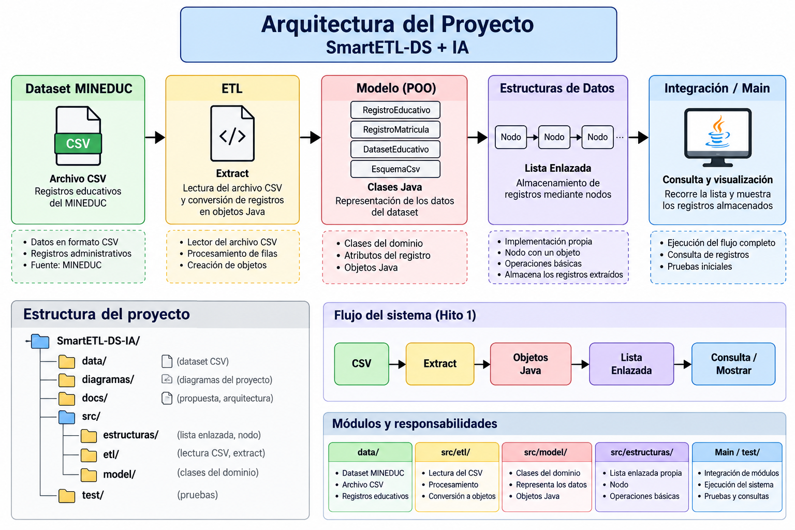

# SmartETL-DS + IA

Proyecto académico de **Estructuras de Datos** orientado al procesamiento de registros educativos del Ministerio de Educación del Ecuador (MINEDUC), utilizando Java, un proceso ETL y estructuras de datos implementadas por el equipo.

## Objetivo

Desarrollar un sistema capaz de extraer información desde un dataset educativo en formato CSV, convertir los registros en objetos Java y almacenarlos inicialmente en una lista enlazada propia.

Durante las siguientes etapas, el proyecto incorporará nuevas estructuras y algoritmos como colas, pilas, búsquedas, ordenamientos, árboles BST, grafos, BFS, DFS e Inteligencia Artificial.

## Flujo del Hito 1

CSV → Extract → Objetos Java → Lista enlazada → Consulta de registros

## Arquitectura

El proyecto se divide inicialmente en los siguientes módulos:

- `data/`: dataset y archivos relacionados con los datos.
- `src/model/`: clases que representan los registros educativos.
- `src/etl/`: lectura y extracción de información desde el CSV.
- `src/estructuras/`: estructuras de datos implementadas por el equipo.
- `test/`: pruebas del sistema.
- `docs/`: documentación técnica del proyecto.
- `diagramas/`: representaciones visuales de la arquitectura.

## Tecnologías

- Java
- Git
- GitHub
- Visual Studio Code
- CSV

## Dataset

El proyecto utiliza registros administrativos educativos del Ministerio de Educación del Ecuador (MINEDUC).

Se trabajará con un dataset amplio para evaluar posteriormente el comportamiento de las estructuras de datos y algoritmos implementados.

## Integrantes

- Andrés
- Cris
- Lenin
- Josué
- Héctor
- Shirley

## Documentación

La documentación del proyecto se encuentra en:

- `docs/propuesta.md`
- `docs/arquitectura.md`

## Estado actual

### Hito 1

Actualmente el proyecto se encuentra en la etapa inicial de desarrollo:

- [x] Repositorio GitHub creado.
- [x] Arquitectura inicial definida.
- [x] Dataset seleccionado.
- [x] Organización modular definida.
- [ ] Dataset integrado al repositorio.
- [ ] Modelo de datos implementado.
- [ ] Extract implementado.
- [ ] Lista enlazada implementada.
- [ ] Integración y pruebas completadas.